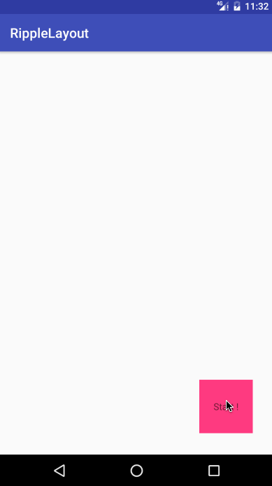
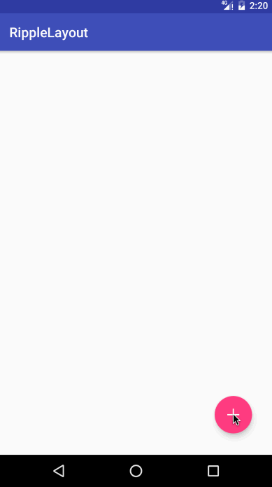

RippleLayout
======================================
A layout that implemented ripple effect.

A ripple is not just a circle that starts expanding from your finger till it covers all the view. In fact, the circle starts expanding from your finger while its center travels to the center of the view with a fixed speed. By the time the circle's center has reached the center of the view its radius will be equal to the distance between the view's center and its farthest edge. In this way, the ripple reaches every edge of the view at almost the same time.

[原文链接](https://plus.google.com/+ChrisBasha/posts/iM4G2nsKmsG)

## Screenshot






## Usage
### Gradle

```
dependencies {
   	compile 'com.liuguangqiang.ripplelayout:library:0.1.0'
}
```

### Maven
```
<dependency>
  <groupId>com.liuguangqiang.ripplelayout</groupId>
  <artifactId>library</artifactId>
  <version>0.1.0</version>
  <type>aar</type>
</dependency>
```

### Start Activity
The ripple animation can start from a Point or a View.

But the transition animation of the target activity must be implemented by yourself.

```
Ripple.startActivity(MainActivity.this, TargetActivity.class, A point or a view);
```

## License

    Copyright 2016 Eric Liu

    Licensed under the Apache License, Version 2.0 (the "License");
    you may not use this file except in compliance with the License.
    You may obtain a copy of the License at

       http://www.apache.org/licenses/LICENSE-2.0

    Unless required by applicable law or agreed to in writing, software
    distributed under the License is distributed on an "AS IS" BASIS,
    WITHOUT WARRANTIES OR CONDITIONS OF ANY KIND, either express or implied.
    See the License for the specific language governing permissions and
    limitations under the License.